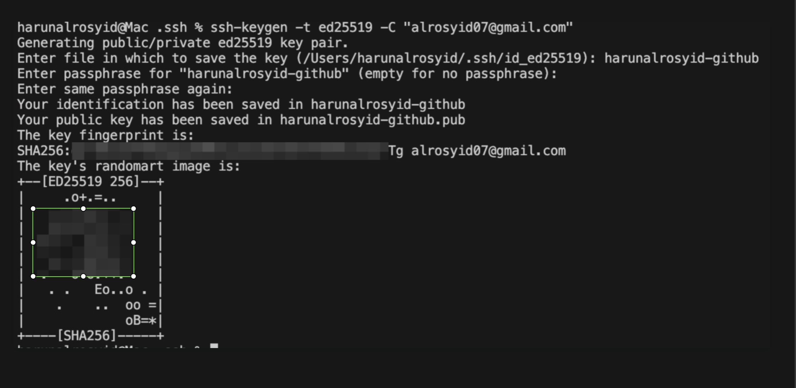
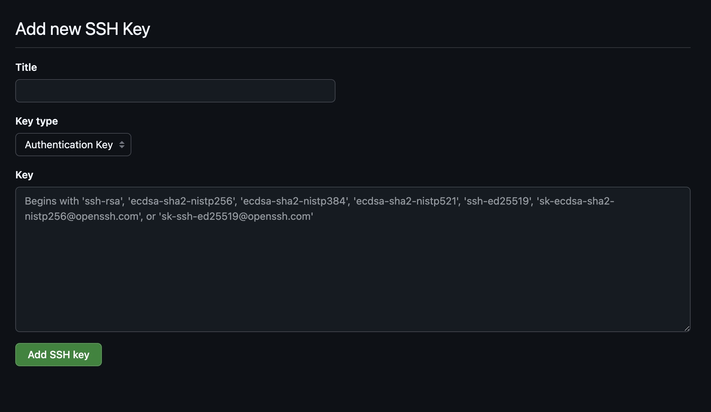
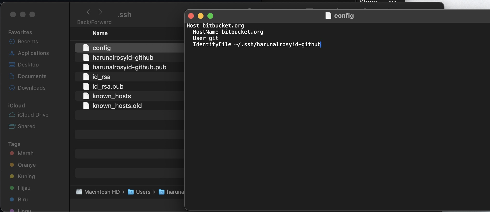

# How to connect to github using SSH

1. Open Directory SSH on your Terminal
   `cd ~/.ssh/`
2. Set keygen `ssh-keygen -t ed25519 -C "<<your_email>>"`
   
   - set your file name

   - just enter in passpharse.

   

3. get public key `cat ~/.ssh/id_yourname.pub`
4. copy and paste to add new ssh github
      

5. add your ssh `ssh-add id_yourname`
6. test connection ssh `ssh -T git@github.com`
   
   You may see a warning like this:
   ```
   The authenticity of host 'github.com (IP ADDRESS)' cant be established.
   ED25519 key fingerprint is SHA256:+DiY3wvvV6TuJJhbpZisF/zLDA0zPMSvHdkr4UvCOqU.
   Are you sure you want to continue connecting (yes/no)?```

7. type yes and enter
   ```
   Hi USERNAME! You've successfully authenticated, but GitHub does not
   provide shell access
   ```
   your connction is success.
8. config your ssh in local machine
   
   `IdentityFile ~/.ssh/id_yourname`

9. try to clone, git pull and git push

Finish your ssh config is completed.


[Harun Al Rosyid](https://github.com/harun-alrosyid)


