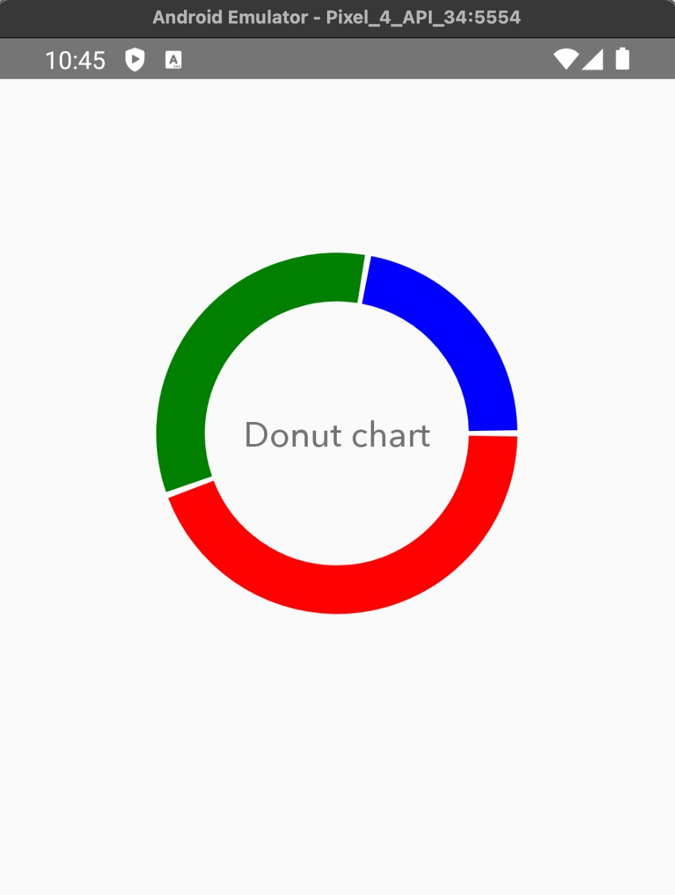

# DonutChart (React Native + `react-native-svg`)

A lightweight, reusable **donut chart** for React Native that supports **multiple custom colors** and a **custom center component**. Built purely with [`react-native-svg`](https://github.com/software-mansion/react-native-svg).

---

## Quick Start

### Prerequisites
- React Native
- `react-native-svg`

### Installation
```bash
# Expo
expo install react-native-svg

# React Native CLI
yarn add react-native-svg
# or
npm i react-native-svg

# last copy component on your project
DonutChart.tsx
```

---

## Types

```ts
export type Segment = {
  value: number;   // numeric value for the slice (must be > 0 to render)
  color: string;   // any valid color (hex/rgb/rgba)
};
```

---

## Props

| Prop | Type | Required | Default | Description |
|---|---|:--:|---|---|
| `segments` | `Segment[]` | ✅ | – | List of slices. Example: `[{ value: 40, color: '#F23C6D' }, ...]`. Total values must be > 0. |
| `radius` | `number` | ❌ | `100` | Radius of the ring’s path (centerline of the stroke). |
| `strokeWidth` | `number` | ❌ | `30` | Thickness of the ring. |
| `startAngle` | `number` | ❌ | `-90` | Start angle in degrees. `0°` points to 3 o’clock. Use `-90` to start at the top (12 o’clock). |
| `gapDegrees` | `number` | ❌ | `2` | Gap between slices (in degrees) at each junction. Set `0` for no gaps. |
| `trackColor` | `string` | ❌ | `undefined` | Optional full background ring color behind slices. Omit if not needed. |
| `centerComponent` | `React.ReactNode` | ❌ | `undefined` | Any component to render in the center (text, icon, custom view, etc.). |
| `roundedCaps` | `boolean` | ❌ | `false` | Rounded (`"round"`) or square (`"butt"`) slice endings. Rounded ends make gaps look visually wider. |

**Behavior notes**
- Effective slice sweep is computed as:  
  `sweep = percentage * 360 - gapDegrees`
- `roundedCaps` + `gapDegrees` can make gaps appear larger due to the rounded stroke ends.
- The SVG size is typically ~ `(radius * 2 + strokeWidth)` for both width and height.

---

## Usage



```tsx
import React from 'react';
import { View, Text } from 'react-native';
import DonutChart from './DonutChart';

export default function Example() {
  return (
    <DonutChart
      segments={[
        { value: 800000, color: 'red' },
        { value: 600000, color: 'green' },
        { value: 400000, color: 'blue' },
      ]}
      radius={90}
      strokeWidth={28}
      startAngle={0}
      gapDegrees={2}
      trackColor="#ffffff"
      centerComponent={
        <View style={{ alignItems: 'center' }}>
          <Text style={{ fontSize: 20, fontWeight: '800' }}>
            Donut chart
          </Text>
        </View>
      }
    />
  );
}
```

---

## Tips & Best Practices

- **Start at top?** Use `startAngle={-90}`.
- **Natural-looking gaps:** `gapDegrees={2–8}` usually looks good.
- **Contrast:** Set a subtle `trackColor` (e.g., light gray/white) so your primary segments stand out.
- **Avoid overdraw:** Extremely small slices (very tiny values) can be visually noisy; consider grouping them.
- **Rounded ends:** If you enable `roundedCaps`, you may want to slightly reduce `gapDegrees` to compensate for the perceived wider gap.

---

## FAQ

**Where do I control the gap between slices?**  
Use the `gapDegrees` prop. It’s measured in **degrees** and applied at every slice junction.

**How do I render custom content in the middle?**  
Pass any React node to `centerComponent` (texts, icons, totals, legend, etc.). It is absolutely centered.

**Can I animate it?**  
Yes wrap the values/angles in Reanimated or drive `strokeDasharray` changes over time. Animation isn’t included by default to keep the core small, but the component is compatible with common RN animation approaches.

---

## Troubleshooting

- **Slice not visible** → Ensure `value > 0` and the total across `segments` is > 0.  
- **Ring looks too thick or overlaps** → Keep `strokeWidth` less than or equal to `radius`.  
- **Gaps look too large** → Reduce `gapDegrees` and/or set `roundedCaps={false}`.

---

## License

MIT   use and modify freely.
